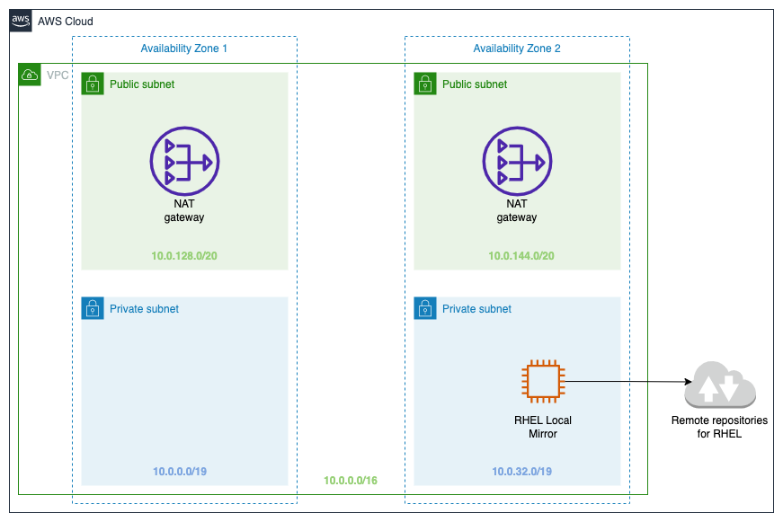

## quickstart-rhel-local-mirror

This Quick Start deploys a local mirror of the latest update for Red Hat Enterprise Linux (RHEL) 8 that is used for downloading and managing updates on the Amazon Web Services (AWS) Cloud. This Quick Start is for system administrators and IT engineers who need to use the local mirror as the endpoint where RHEL8 servers are authorized to acquire updates.

You can use the AWS CloudFormation templates included with the Quick Start to deploy the RHEL Local Mirror in your AWS account in about 30 minutes. The Quick Start automates the following:

* [Deploying the RHEL 8 local mirror into a new VPC](./templates/quickstart-rhel-local-mirror-main.template.yaml)
* [Deploying the RHEL 8 local mirror into an existing VPC](./templates/quickstart-rhel-local-mirror-workload.template.yaml)
* [Deploying a sample client that is configured to pull updates and packages from the local mirror instead of the remote repositories](./templates/quickstart-rhel-local-mirror-client.template.yaml)

For architectural details, step-by-step instructions, and customization options, see the [deployment guide](https://aws-quickstart.github.io/quickstart-rhel-local-mirror/).

To post feedback, submit feature ideas, or report bugs, use the **Issues** section of this GitHub repo.

To submit code for this Quick Start, see the [AWS Quick Start Contributor's Kit](https://aws-quickstart.github.io/).